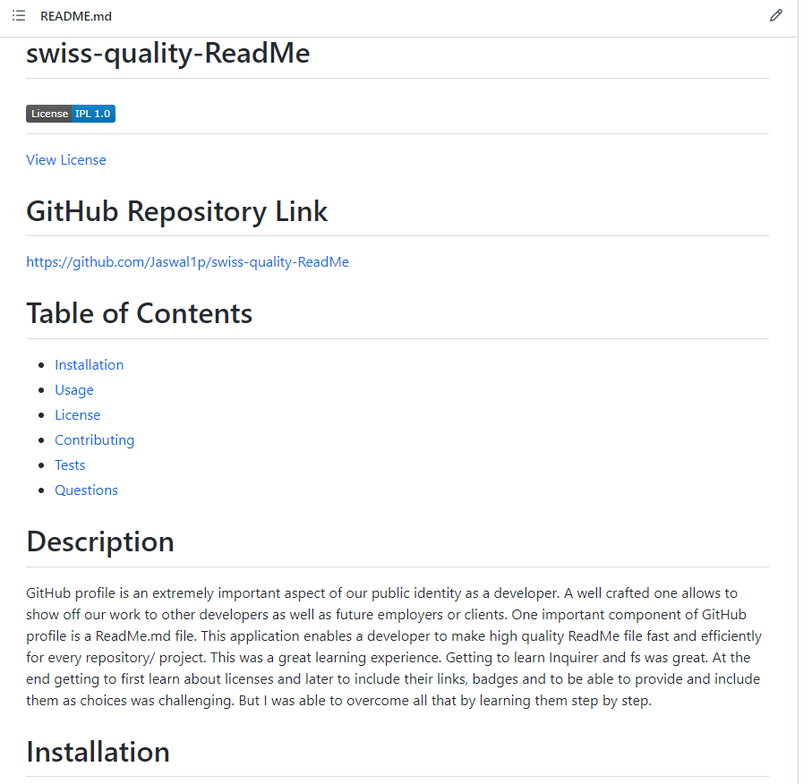

# swiss-quality-ReadMe
 
 ##  
[View License](https://opensource.org/licenses/IPL-1.0) 
 
 # GitHub Repository Link
 https://github.com/Jaswal1p/swiss-quality-ReadMe
 # Table of Contents
 * [Installation](#installation)
 * [Usage](#usage)
 * [License](#license)
 * [Contributing](#contributing)
 * [Tests](#tests)
 * [Questions](#questions)
 
 # Description
 GitHub profile is an extremely important aspect of our public identity as a developer. A well crafted one allows to show off our work to other developers as well as future employers or clients. One important component of GitHub profile is a ReadMe.md file. This application enables a developer to make high quality ReadMe file fast and efficiently for every repository/ project. This was a great learning experience. Getting to learn Inquirer and fs was great. At the end getting to first learn about licenses and later to include their links, badges and to be able to provide and include them as choices was challenging. But I was able to overcome all that by learning them step by step. 
 # Screenshot
 
 # Installation
 The following must be installed to run this application.
 Node.js, fs, npm dependencies, package.JSON, VScode, GitHub, licenses and their badges.
 # Usage
 In order to use this app, command line enter index.js
 # License 
 > This project is licensed under the IBM license.
 >
 > Click the above link adjacent to badge to read further details.
 
 # contributing
 Contributors: I and only I
 # Tests
 The following is needed to run the test: dddgdgsdggdg
 # Questions
 If you have any questions about the repo/project, please open an issue or contact by: 
 
 my github username: [Jaswal1p](https://github.com/Jaswal1p) 
 
 my email: Jaswal1p@yahoo.com
 
